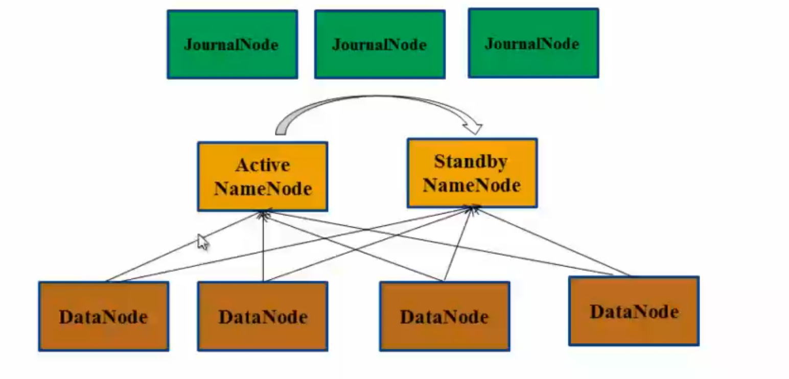
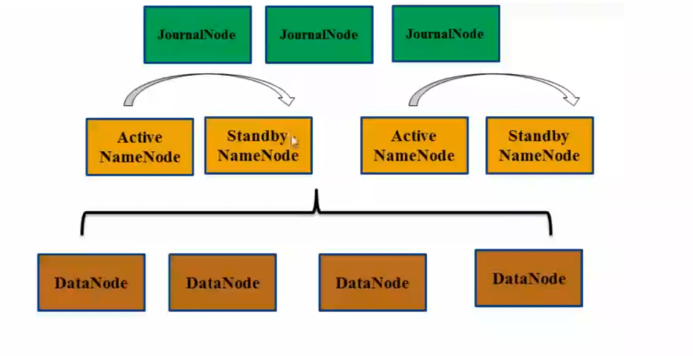
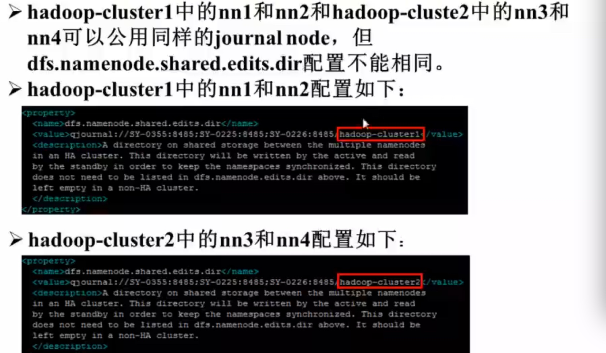
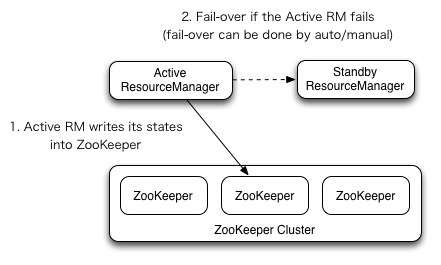

[TOC]

# Hadoop2.0 安装方法
1. 自动安装部署
    + Ambari
    + Minos  小米公司开源
    + Cloudera Manager 
2. RPM包安装部署
    +  apache hadoop不提供
    +  HDP和CDH提供
3. 使用Jar包安装
   中大公司都采用这种安装方式，灵活，可以定制
   
   
# hadoop2.0安装部署流程
1. 准备硬件
2. 准备软件安装包，并安装基础软件
3. 将hadoop安装包分发到各个节点的同一目录下，并解压
4. 修改配置文件 (非常关键)
5. 启动服务
6. 验证是否启动成功

# hadoop2.0 发行版
1. Apache hadoop
最原始版本，所有的发行版均基于该发行版实现

2. HDP
Hortonworks 公司的发行版

3. CDH
cloudera公司的发行版

推介使用商用公司的开源发行版
推介使用CDH或者HDP， 国内CDH比较常用

# Hadoop2.0安装包目录结构分析
+ bin: Hadoop最基本的管理脚本和使用脚本所在的目录， 这些脚本是sbin目录管理脚本的基础实现， 用户可以直接使用这些脚本管理和使用hadoop
+ etc: Hadoop配置文件所在的目录， 包括core-site.xml，hdfs-site.xml，mapred-site.xml等从hadoop1.0继承而来的配置文件和yarn-site.xml等hadoop2.0新增的配置文件
+ include: 对外提供的编程库头文件（具体动态库和静态库在lib目录中），这些头文件均用C++定义， 通常用于C++程序访问hdfs或者编写mapreduce程序
+ lib: 该目录包含了Hadoop对外提供的编程动态库和静态库，与include目录的头文件结合使用
+ libexec: 各个服务对应的shell配置文件所在的目录，可用于配置日志输出目录、启动参数(比如JVM参数)等基本信息
+ sbin: Hadoop管理脚本所在的目录，主要包含HDFS和YARN中各类服务的启动、关闭脚本
+ share: Hadoop各个目录编译后的jar包所在的目录

# hadoop2.0测试环境安装部署
1. 解压
2. 修改etc/hadoop的xml配置文件

**hadoop-env.sh修改配置**
        
    export JAVA_HOME=
 
**slaves 文件修改**
    
    host1
    host2
    
**mapred-site.xml**
    
    <property>
        <name>mapreduce.freamework.name</name>
        <value>yarn</value>
    </property>
    
**core-site.xml**
    
    <property>
        <name>fs.default.name</name>
        <value>hdfs://NAMENODE:8020</value>
    </property>
    <property>
        <name>dfs.replication</name>
        <value>1</value>
    </property>
    
**yarn-site.xml**
    
    <property>
        <name>yarn.nodemanager.aux-services</name>
        <value>mapreduce_shuffle</value>
    </property>
    
## 启动服务

+ 格式化HDFS

        bin/hadoop namenode -format
        
+ 启动HDFS

        sbin/start-dfs.sh
        
+ 启动yarn

        sbin/start-yarn.sh
        
        
## 配置相关
+ **dfs.namenode.name.dir** 用来存储namenode的数据地址，默认是在/tmp/下
+ **dfs.datanode.data.dir** 用户存储datanode的相关数据的目录，默认是在/tmp下

# hadoop2.0生产环境安装部署
## 注意
+ 主备Namnode有多种配置方法，如QJM和NFS方式。本文介绍JournalNode方式， 需要准备三个节点作为Journalnode，三个节点可以与其他服务共用节点
+ 主备俩个Namenode应该位于不同的机器上，这俩个机器不要在部署其他的服务了。（HDFS2.0中无需再部署和配置Secondary Name， 备Namenode已经代替它完成相应的功能）
+ 主备Namenode之间有俩种切换方式： 手动切换和自动切换，其中自动切换借助Zookeeper实现，因此需要单独部署一个ZK集群。

## 集群的三种部署方式
+ HDFS HA部署方式
+ HDFS HA + Federation部署方式
+ YARN部署方式

## HDFS HA部署架构图

### hdfs-site.xml配置

+ dfs.nameservices
集群中命名服务列表

+ dfs.ha.namenodes.${ns}
命名服务中的namenode逻辑名称(自定义)

+ dfs.namenode.rpc-address.\${ns}.${nn}
命名服务中逻辑名称对应的RPC地址

+ dfs.namenode.http-address.\${ns}.${nn}
命名服务中逻辑名称对应的HTTP地址

+ dfs.namenode.name.dir
Namenode fs image 存放目录, 可以配置多个， 用逗号分隔

+ dfs.datanode.data.dir
datanode 的数据存储目录，也可以配置多个，用逗号分隔

+ dfs.namenode.shared.edits.dir
主备Namenode同步元信息的共享存储系统，journal的地址

+ dfs.ha.automatic-failover.enabled
是否自动的failover

+ dfs.journalnode.edits.dir
Journal Node数据存放目录

### core-site.xml 配置
+ fs.deaultFS
可以是具体的namenode或者逻辑的nameservice

### slaves配置

## 启动服务
1. 在各个journalnode上启动服务

        sbin/hadoop-daemon.sh start journalnode
        
2. 在nn1上对namenode格式化并启动

        bin/hdfs namenode -format
        sbin/hadoop-daemon.sh start namenode
        
3. 在nn2上同步nn1的元数据信息,并对其进行格式化

        bin/hdfs namenode -bootstrapStandby
        
4. 在nn2上启动namenode

        sbin/hadoop-daemon.sh start namenode
        
    **经过以上四步, nn1和nn2均处于standby状态**

5. 切换namenode
    
    1. 手动在nn1上将namenode切换为active
    
            bin/hdfs haadmin -transitionToActive nn1
            
    2. HDFS High Availability Using the Quorum Journal Manager
            
       在nn1或者nn2上格式化zkfc
       
            bin/hdfs zkfc -formatZK
            
       在nn1和nn2上启动zkfc，自动决定active namenode
       
            sbin/hadoop-daemon.sh start zkfc
            
       或者``start-dfs.sh `` 自动启动zkfc
        
6. 在nn1上启动所有的datanode(hadoop-daemons)

        sbin/hadoop-daemons.sh start datanode
    
    
    
关闭hadoop集群

        sbin/stop-dfs.sh
    

## HDFS  HA+Federation部署架构图

### hdfs-site.xml 配置
+ dfs.nameservices
配置俩个

### 注意
+ 俩个主备集群hadoop-cluster1和hadoop-cluster2的namenode可以共用journalnode，但是dfs.namenode.shared.edits.dir配置不能相同

### 启动服务
**在nn1,nn2上节点进行如下操作**
1. 在各个journalnode上启动服务

        sbin/hadoop-daemon.sh start journalnode
        
2. 在nn1上对namenode格式化并启动

        bin/hdfs namenode -format -clusterId hadoop-cluster
        sbin/hadoop-daemon.sh start namenode
        
3. 在nn2上同步nn1的元数据信息,并对其进行格式化

        bin/hdfs namenode-bootstrapStandby
        
4. 在nn2上启动namenode

        sbin/hadoop-daemon.sh start namenode
        
**经过以上四步, nn1和nn2均处于standby状态**

5. 在nn1上将namenode切换为active

        bin/hdfs haadmin -ns hadoop-cluster1 -transitionToActive nn1
        
    
**在nn3和nn4俩个节点上进行如下操作    

1. 在各个journalnode上启动服务

        sbin/hadoop-daemon.sh start journalnode
        
2. 在nn3上对namenode格式化并启动

        bin/hdfs namenode -format -clusterId hadoop-cluster
        sbin/hadoop-daemon.sh start namenode
        
3. 在nn4上同步nn1的元数据信息,并对其进行格式化

        bin/hdfs namenode-bootstrapStandby
        
4. 在nn4上启动namenode

        sbin/hadoop-daemon.sh start namenode
        
**经过以上四步, nn1和nn2均处于standby状态**

5. 在nn3上将namenode切换为active

        bin/hdfs haadmin -ns hadoop-cluster2 -transitionToActive nn1
        

在nn1上启动所有的datanode(hadoop-daemons)

        sbin/hadoop-daemons.sh start datanode

## YARN部署架构图

### yarn-site.xml配置实例
+ yarn.resourcemanager.host
+ yarn.resourcemanager.address
+ yarn.resourcemanager.schedule.address
+ yarn.resourcemanager.webapp.address
+ yarn.resourcemanager.webapp.https.address
+ yarn.resourcemanager.resource-tracker.address
+ yarn.resourcemanager.admin.address
+ yarn.resourcemanager.scheduler.class
+ yarn.scheduler.fair.allocation.file
+ yarn.nodemanager.local-dirs
+ yarn.log-aggregation-enable
+ yarn.nodemanager.remote-app-log-dir
+ yarn.nodemanager.resource.memory-mb
+ yarn.nodemanager.resource.cpu-vcores
+ yarn.nodemanager.aux-services

### fairscheduler.xml

将集群的资源划分为若干个队列， 管理集群资源

### mapred-site.xml

+ mapreduce.framework.name
+ mapreduce.jobhistory.address
+ mapreduce.jobhistory.webapp.address

## 启动服务
+ 启动yarn
    
        sbin/start-yarn.sh
    
+ 停止yarn

        sbin/stop-yarn.sh
        
+ 启动MR JobHistory Service
    需要在`` mapreduce.jobhistory.address``这个机器上来启动

        sbin/mr-jobhistory-daemon.sh start historyserver
        
        
        
#ResourceManager High Availability

hadoop 2.4之后，对resourcemanager 添加了HA功能，有效的保证了yarn的可用性

## HA配置

    <property>
      <name>yarn.resourcemanager.ha.enabled</name>
      <value>true</value>
    </property>
    <property>
      <name>yarn.resourcemanager.cluster-id</name>
      <value>cluster1</value>
    </property>
    <property>
      <name>yarn.resourcemanager.ha.rm-ids</name>
      <value>rm1,rm2</value>
    </property>
    <property>
      <name>yarn.resourcemanager.hostname.rm1</name>
      <value>master1</value>
    </property>
    <property>
      <name>yarn.resourcemanager.hostname.rm2</name>
      <value>master2</value>
    </property>
    <property>
      <name>yarn.resourcemanager.webapp.address.rm1</name>
      <value>master1:8088</value>
    </property>
    <property>
      <name>yarn.resourcemanager.webapp.address.rm2</name>
      <value>master2:8088</value>
    </property>
    <property>
      <name>yarn.resourcemanager.zk-address</name>
      <value>zk1:2181,zk2:2181,zk3:2181</value>
    </property>       
        
## 启动服务

1.  在rm1上启动yarn服务
    
        sbin/start-yarn.sh

    此时，rm以及所有的nm都会启动
    
2. 在rm2上单独启动yarn服务
  
        sbin/yarn-deamon.sh start resourcemanager
 
    此时rm2上resourcemanager已经启动
    

     

