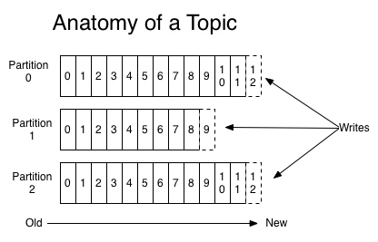
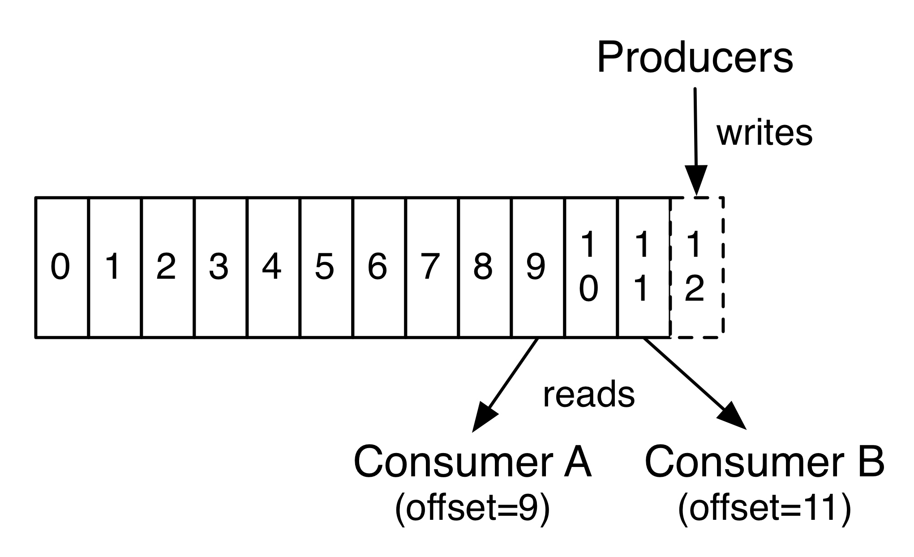
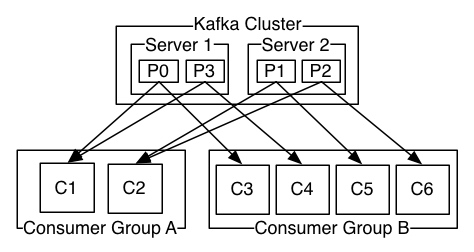

[TOC]

#Kafka

Kafka only provides a total order over records within a partition, not between different partitions in a topic. Per-partition ordering combined with the ability to partition data by key is sufficient for most applications. However, if you require a total order over records this can be achieved with a topic that has only one partition, though this will mean only one consumer process per consumer group.

