[TOC]
#  机器学习基础

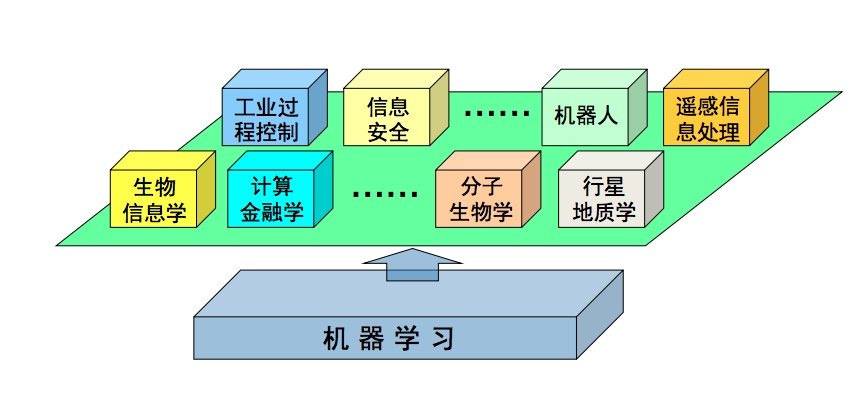

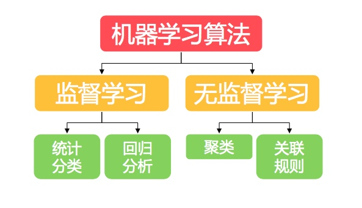

## 有监督学习
+ 有监督的学习方法

在样本标签已知的情况下，可以统计出各类训练样本不 同的描述量，如其概率分布，或在特征空间分布的区域 等，利用这些参数进行分类器设计，称为有监督的学习 方法。

## 无监督学习
+ 无监督学习
    + 然而在实际应用中，不少情况下无法预先知道样本的标
签，也就是说没有训练样本
    + 因而只能从原先没有样本标签的样本集开始进行分类器 设计，这就是通常说的无监督学习方法。
+ 对一个具体问题来说有监督与无监督的作法是不相同的

## 机器学习实时过程

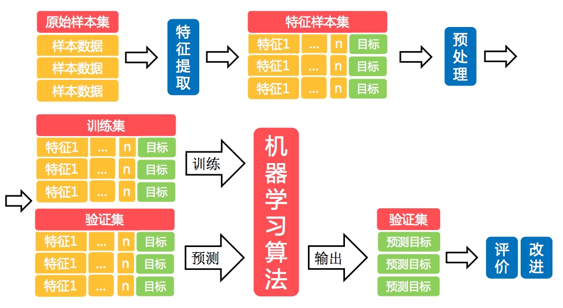

# Spark MLlib
MLlib 是 Apache Spark中的组件之一，专注 于机器学习:

+ MLlib是Spark中的核心机器学习库 
+ 由AMPLab实验室的Mlbase团队开发 
+ 由来个各个机构的超过80个代码贡献者 
+ 支持Scala, Python, Java 和R语言

## 为什么使用MLlib

+ 弹性扩容 
+ 性能好
+ 文档友好
+ 维护开销底

scikit-lean 为python的一个机器学习包，但是是单机的

## MLlib构成
+ 两个算法包 
    + spark.mllib:包含原始API，构建在RDD之上 
    + spark.ml:基于DataFrame构建的高级API
+ 如何选择
    + spark.ml 具备更优的性能和更好的扩展性，建议优先选用;
    + Spark.mllib仍将继续更新，且目前包含更多(相 比于spark.ml)的算法

目前所有的spark框架，都在想dataframe和dataset转移，spark streaming 中的structure streaming就是基于dataframe来做的实时框架， spark.ml也是基于dataframe来的机器学习框架

+ 数据类型(Data Type)
    + 向量，带类别的向量，矩阵等
    + 数学统计计算库
+ 基本统计量(min, max, average等)，相关分析，随机数产生器，假设检验等
+ 机器学习管道(pipeline)
    + Transformer
    + Estimator 
    + Parameter
机器学习算法
    + 分类算法
    + 回归算法
    + 聚类算法
    + 协同过滤

### 数据类型
+ Vector
    + Dense vector 
    + Sparse vector 
    + Labeled point
+ Matrix
    + Local Matrix 
    + Distributed Matrix
#### Dense & Sparse

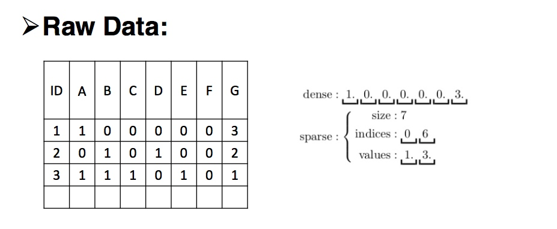

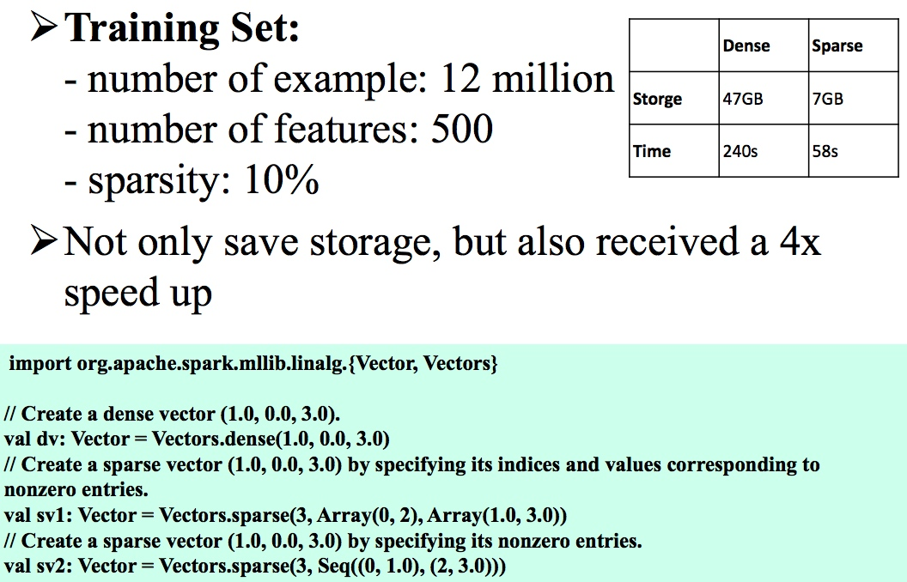

#### Labeled Point

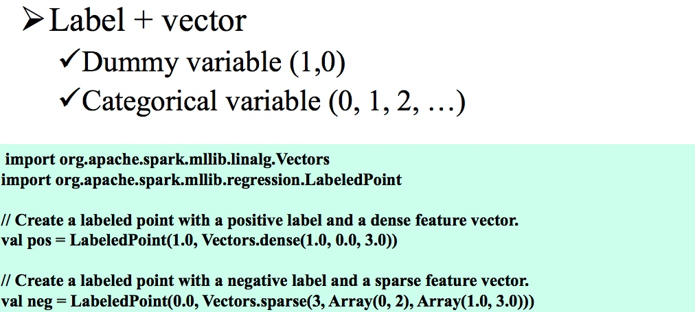

#### LOCAL Matrix
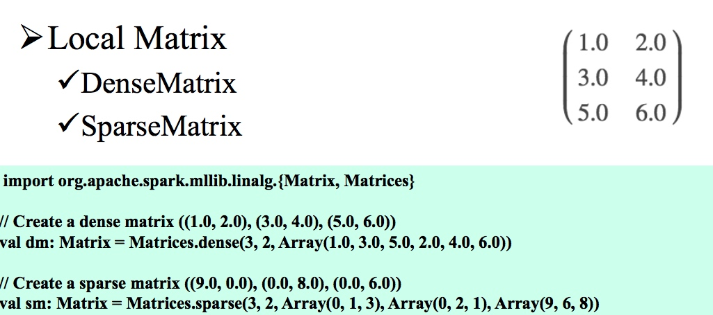

#### Distributed Matrix
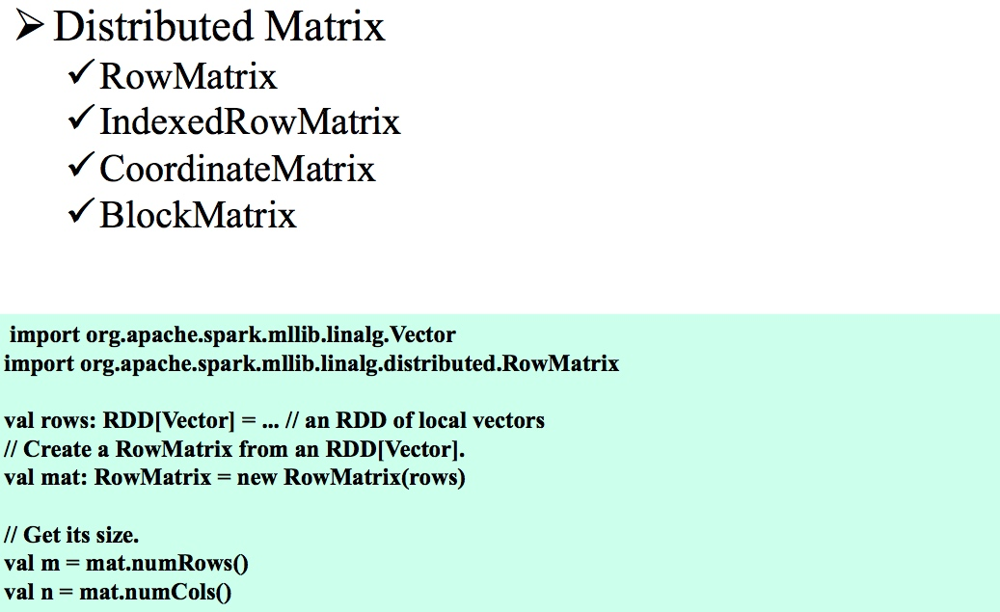

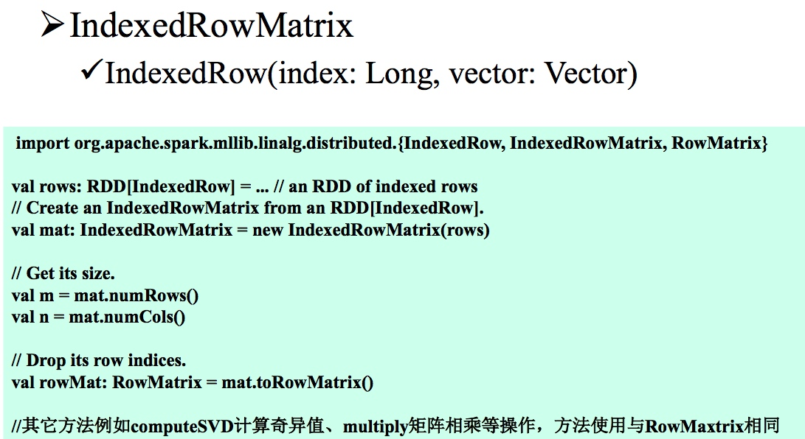

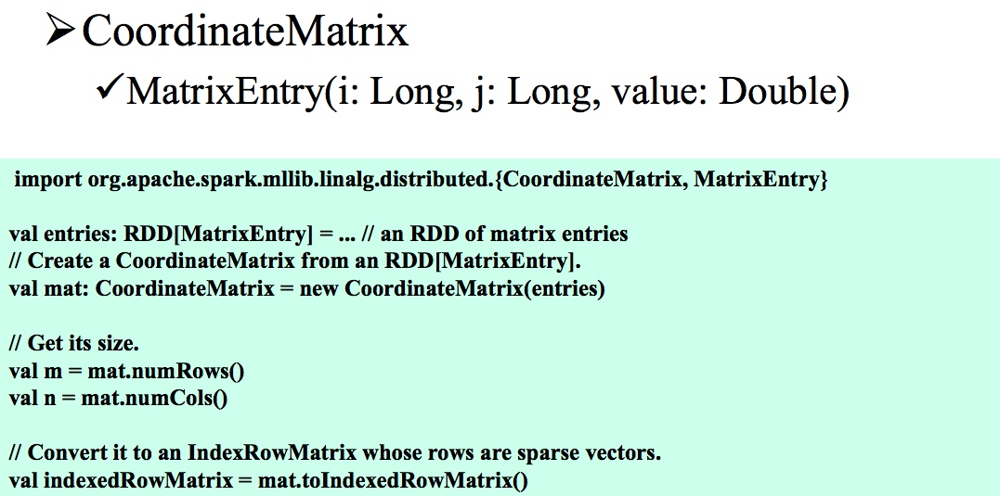

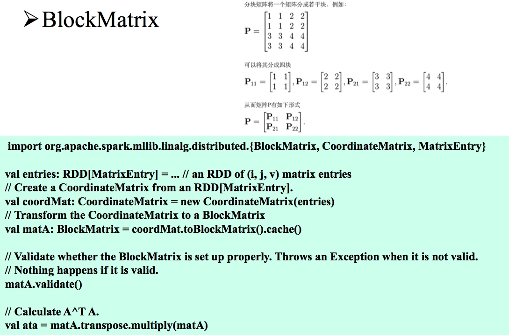

### 数据统计计算库

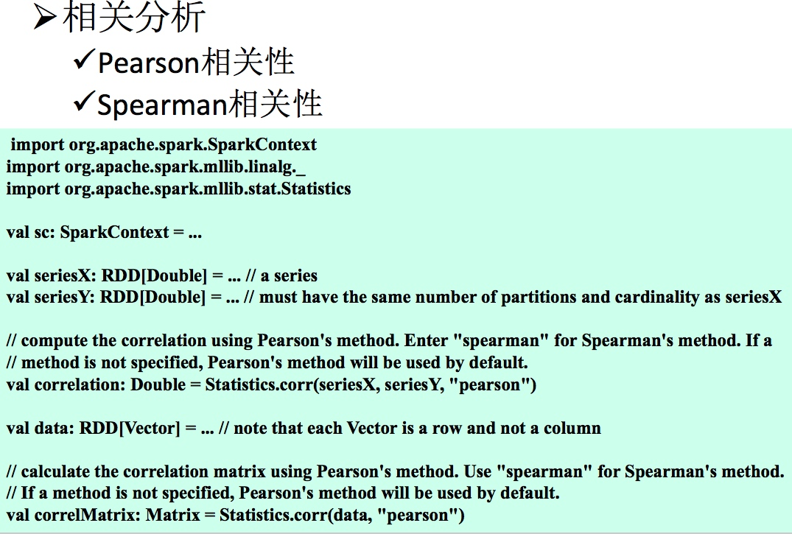
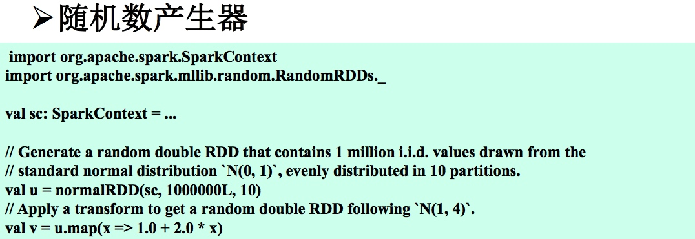

## Spark ML Pipeline

+ 机器学习管道(Pipeline)
    + 由一系列阶段构成，每个阶段是Transformer或Estimator，它们串联到一起按照顺序执行。 
+ 数据管道组件构成
    + Transformer:算法可以把一个DataFrame转换成另一个 DataFrame。
        + 特征转换器(feature transformer):读取输入数据集中的一列(比如 text)，将产生新的特征列
        + 学习模型(learning model)，将一个有特征列的DataFrame转换成一 个有预测信息的DataFrame
    + Estimator:Estimator就是一种机器学习算法，会从输入数据 中进行学习，并产生一个训练模型(Transformer)。

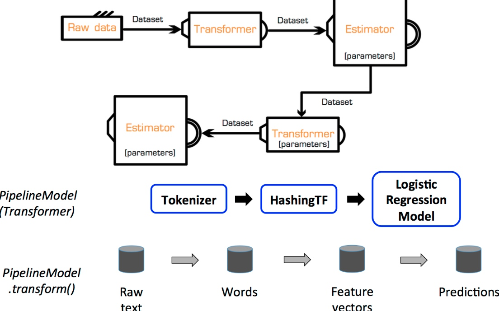

#### Transformer与Estimator
+ Transformer:transform()方法 
+ Estimator:fit()方法

+ Feature Extractors
    + TF-IDF
    + Word2Vec
    + CountVectorizer
+ Feature Transformers
    + Tokenizer
    + StopWordsRemover
    + $n$-gram
    + Binarizer
    + PCA
    + PolynomialExpansion
    + Discrete Cosine Transform (DCT)
    + StringIndexer
    + IndexToString
    + OneHotEncoder
    + VectorIndexer
    + Interaction
    + Normalizer
    + StandardScaler
    + MinMaxScaler
    + MaxAbsScaler
    + Bucketizer
    + ElementwiseProduct
    + SQLTransformer
    + VectorAssembler
    + QuantileDiscretizer
+ Feature Selectors
    + VectorSlicer
    + RFormula
    + ChiSqSelector
+ Locality Sensitive Hashing
    + LSH Operations
        + Feature Transformation
        + Approximate Similarity Join
        + Approximate Nearest Neighbor Search
    + LSH Algorithms
        + Bucketed Random Projection for Euclidean Distance
        + MinHash for Jaccard Distance

#### 测试
+ BinaryClassificationMetrics 
    + 计算ROC、AUC
+ MulticlassMetrics 
    + 计算准确率、召回率、F1 score
+ RegressionMetrics 
    + 均方差、R2等

例如：

    val fullPredictions = model.transform(testdata).cache()
    val predictions = fullPredictions.select("prediction").rdd.map(_.getDouble(0))      
    val labels = fullPredictions.select(labelColName).rdd.map(_.getDouble(0))
    val metrics = new MulticlassMetrics(predictions.zip(labels))
    val accuracy = metrics.accuracy val recall = metrics.recall

###  ML中的分类和回归算法
 
+ Classification
	+ Logistic regression
		+ Binomial logistic regression
		+ Multinomial logistic regression
	+ Decision tree classifier
	+ Random forest classifier
	+ Gradient-boosted tree classifier
	+ Multilayer perceptron classifier
	+ One-vs-Rest classifier (a.k.a. One-vs-All)
	+ Naive Bayes
+ Regression
	+ Linear regression
	+ Generalized linear regression
		+ Available families
	+ Decision tree regression
	+ Random forest regression
	+ Gradient-boosted tree regression
	+ Survival regression
	+ Isotonic regression
		+ Examples
+ Linear methods
+ Decision trees
	+ Inputs and Outputs
		+ Input Columns
		+ Output Columns
+ Tree Ensembles
	+ Random Forests
		+ Inputs and Outputs
			+ Input Columns
			+ Output Columns (Predictions)
	+ Gradient-Boosted Trees (GBTs)
		+ Inputs and Outputs
			+ Input Columns
			+ Output Columns (Predictions)

			
#### 推荐算法
+ 协同过滤(Collaborative Filtering，简称CF)推 荐算法，CF的基本思想是根据用户之前的喜好
 以及其他兴趣相近的用户的选择来给用户推荐物
 品。
+ CF算法分类 
    + User-based:基于用户对物品的偏好找到相邻邻居用户，然后将邻居用户喜欢的推荐给当前用户。
    + Item-based:基于用户对物品的偏好找到相似的物品 然后根据用户的历史偏好，推荐相似的物品给他。

