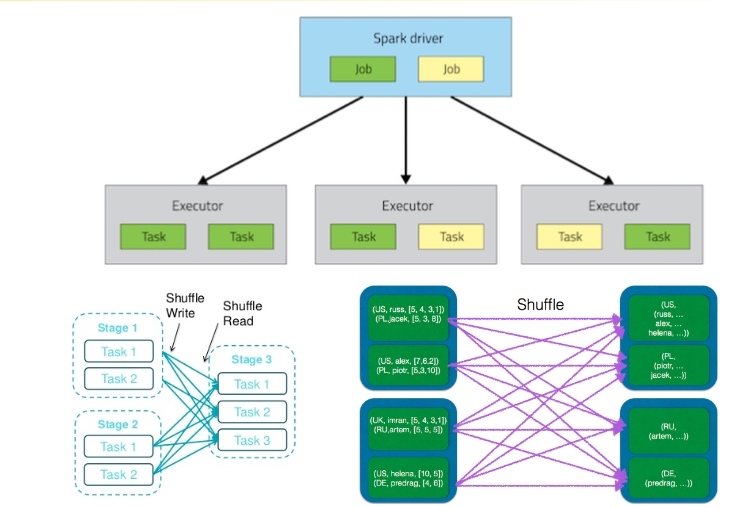
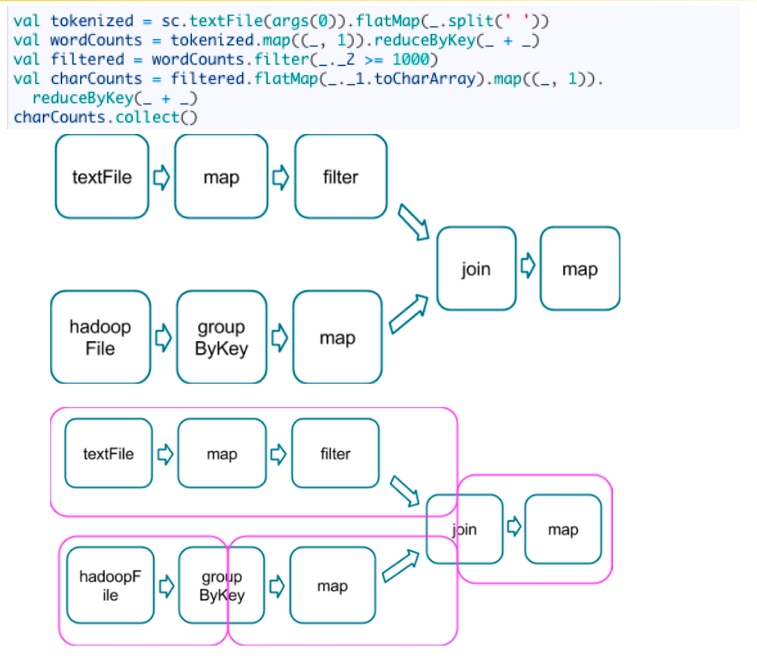
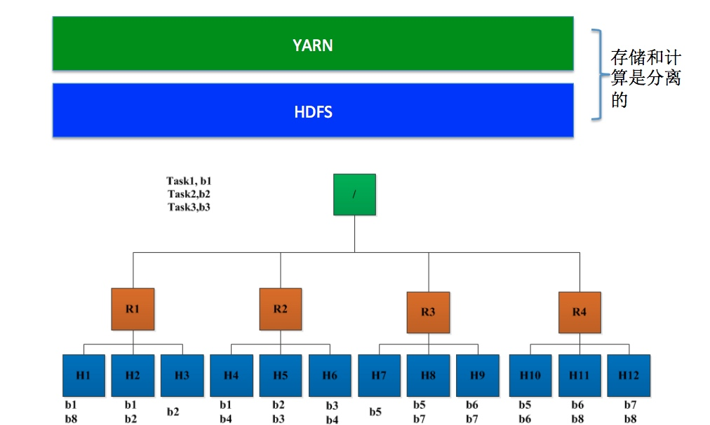
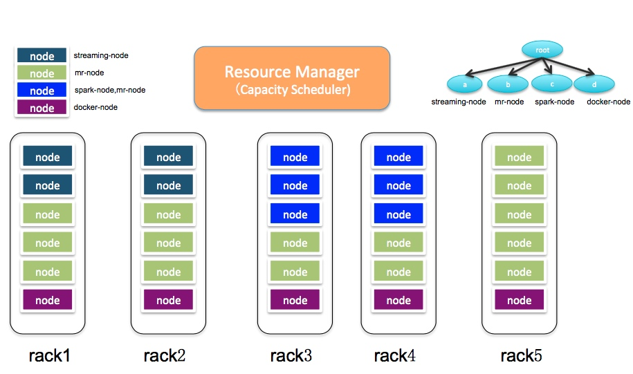
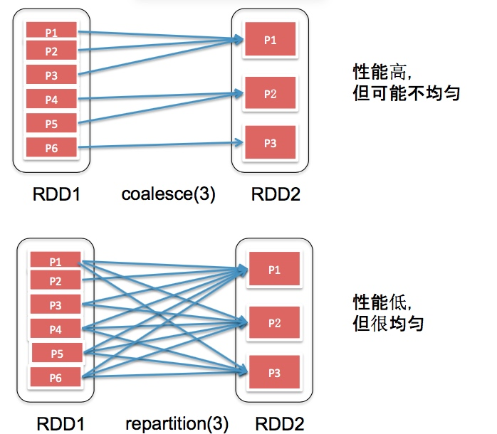
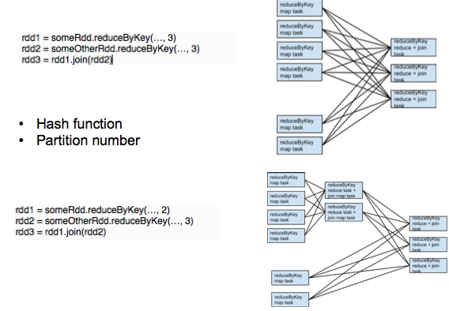

[TOC]
# 企业运行spark方式
1. spark开发测试
    + Intellij IDEA（不能远程提交到集群）
    + local模式
2. spark 生成环境运行
    + 打成 assembly jar
        + assembly jar： 所有依赖的包都会被打进去，比较独立，而且不会受到环境其他jar包影响   
    + 使用yarn cluster模式
        + yarn 提供 driver级别的容错   
    + 使用工作流调度器
        + airflow  : 可以重调，发告警  
        + oozie

# 阿里云maven仓库
      
          <repositories>
            <repository>
              <id>nexus-aliyun</id>
              <name>Nexus aliyun</name>
              <url>http://maven.aliyun.com/nexus/content/groups/public</url>
            </repository>
          </repositories>

# spark参数设置方式
1. 程序内设置
    
        conf.set("spark.master", "local[*]")
        conf.set("spark.ui.enabled", true)

2. 提交参数
    
        spark-submit \
            --master local[*]\
            --conf spark.master=local[*]\
            --conf spark.ui.enabled=true

3. 配置文件设置
    
        conf/spark-default.conf

**1,2,3 优先级从高到底**

# Spark应用经验及调优

## spark调优初体验

1. 设置合适的资源
    + 资源量
        + 是否充分使用了集群中的资源   
        + Executor个数，每个executor的内存和core等
    + 增加资源
        + 增加Executor个数 (--num-executors 4)
        + 增加每个executor可同时运行的task数目(--executor- cores 2)    
2. 调整任务并行度
    + 多少个并行的任务    
        + Map任务并行度    
        + Reduce任务并行度
    + 适当调整任务数目
        + Map个数:默认与hdfs block/hbase region数目一致
            + 把map数目调大:sc.textFile(“/input/data”, 100)
            + 把map数目调小(将每个map处理数据量调大，默认128MB)
        
                    --conf spark.hadoop.mapreduce.input.fileinpu@ormat.split.minsize=100000000
                    sc.hadoopConfiguraFon.set("mapreduce.input.fileinpu@ormat.split.minsize", "1000000000")

查看一个文件有多少个block，位置

            bin/hdfs fsck /data/bank.csv -files -blocks -locations                    
                    

3. 修改存储格式(列存储)
    + parquet
    + orc 
**文本文件， 如果有1000列，只读其中几列，也需要把全部列读出来，所以转为列式存储格式**

            
## spark运行原理

## spark 调优辅助工具
+ spark 界面
+ jstack，jstat，jprofile
+ 查看日志

修改yarn-site.xml(需要重启所有NodeManager生效)

        <property> 
            <name>yarn.log-aggregaFon-enable</name> 
            <value>true</value>
        </property>


用命令查看日志
    
        bin/yarn logs -applicaFonId applicaFon_1475114853744_0041

## spark 调优准备： 启动spark history server

+ Spark history server:查看运行完成作业的信息和 日志(假设启动在机器chinahadoop-1上)
    + yarn-site.xml(需要重启所有NodeManager生效)

            <property>
                <name>yarn.log.server.url</name>                
                <value>http://chinahadoop-1:19888/jobhistory/logs</value>
            </property>
  
    + conf/spark-defaults.conf (下面的目录/tmp/spark/events
事先在HDFS创建好)
            
            spark.yarn.historyServer.address=chinahadoop-1:18080 
            spark.history.ui.port=18080
            spark.eventLog.enabled=true 
            spark.eventLog.dir=hdfs:///tmp/spark/events 
            spark.history.fs.logDirectory=hdfs:///tmp/spark/events
            
    + 启动spark history server

            sbin/start-history-server.sh
        
      Spark History server地址   
            
            http://chinahadoop-1:18080/

## spark 程序调优
+ 思路1： spark运行环境：存储与计算资源
+ 思路2: 优化RDD操作符的使用方式
+ 思路3: 参数调优
    + 主要是两方面:序列化和缓冲区
    + Spark程序传递参数方法: 
        + --conf
        + new SparkConf().set()
        
**官网上有所有参数的说明**

### spark运行环境调优
#### 防止不必要的jar包上传与分发

+ 将系统jar包上传到HDFS上，直接使用HDFS上的文件
    + 在Spark安装目录下运行:jar cv0f spark-libs.jar -C jars/ .
    + 将spark-libs.jar 上传到HDFS上:bin/hadoop dfs -put spark-libs.jar /system/spark
    + conf/spark-defaults.conf中添加以下配置:
        
            spark.yarn.archive=hdfs:///system/spark/spark-libs.jar
    
+ 将用户应用程序jar包上传到HDFS上，防止重复分发
    
        spark-submit \
            --master yarn-cluster \
            --class org.training.examples.WordCount \
            hdfs://users/spark/jars/examples-1.0-SNAPSHOT.jar

如何查看整个spark的运行轨迹呢？
1. 放开log4j.properties
2. 将日志等级设置为INFO `` log4j.logger.org.apache.spark.repl.Main=INFO``
3. 在启动的时候添加参数``--verbose``
                bin/spark-shell --master yarn --deploy-mode client --num-executors 4 --executor-cores 3 --verbose
    
    
#### 提高数据本地性(Data Locality)
    
+ 数据本地性非常重要
+ 数据本地性分类:PROCESS_LOCAL, NODE_LOCAL, RACK_LOCAL
+ 提高数据本地性
    + 计算和存储同节点部署
    + 增加executor 数目
    + 增加数据副本数
    + 调整spark.locality.wait(默认是:3s)，spark.locality.wait.process，spark.locality.wait.node, spark.locality.wait.rack

##### 数据本地性

+ 什么是数据本地性(data locality)   
    + 如果任务运行在它将处理的数据所在的节点，则称该任务
具有“数据本地性”   
    + 本地性可避免跨节点或机架数据传输，提高运行效率
+ 数据本地性分类   
    + 同节点(node-local)
    + 同机架(rack-local)   
    + 其他(off-switch)

    
    
    
    尽可能的将yarn和hdfs部署在一套集群上，还需要看一下 LOCALITY LEVEL , 尽量都是NODE_LOCAL
    
#### 存储格式选择
    
+ 行式存储和列式存储
  + 列式存储优势:减少读IO量，占用存储空间少(压缩 比高)
+ 列式存储格式
  + ORC (https://orc.apache.org/)，源于Hive
  + Parquet (http://parquet.apache.org/), 跟MR/Spark/...等有 良好的集成

  
  
  
  
#### 将Spark运行在高配置机器上

+ YARN基于标签的调度
   + Hadoop 2.6.0开始，提供了基于标签的调度策略
   + [NodeLabel.html](http://hadoop.apache.org/docs/r2.7.3/hadoop-yarn/hadoop-yarn-site/ NodeLabel.html)
+ 思路
   + 将一些高配置机器打上spark-node/streaming-node标签，并结合队列配置(比如spark队列)使之生效;
   + 将所有spark程序提交到spark队列中
   
            spark-submit –queue spark ....
  需要使用Capacity Seheduler
  
  

### 优化操作符

#### 过滤操作导致产生很多小任务 

    rdd = sc.textFile("")
    .map(x => x.split("."))
    .filter()
    .filter()
    
    
filter 操作，会对每个partition进行过滤，产生的rdd数据有可能不均衡， 如有的partition大多都被过滤掉了，而有的partition大多都没有被过滤掉，这样如果直接进行下一步的计算，就会托整个工作流的后腿

解决方案：**对数据过滤后，使用coalesce(默认不进行shuffle，推荐使用) 或者repartition(默认进行shuffle)操作符合并若干分片(Partition)**

    rdd.coalesce(30).map()
    
+ **coalesce** 合并已经有的partition， 不均匀
+ **repartition** shuffle后等量划分，均匀的

#### 降低单条记录处理开销

比如要讲每一条数据写入db

    rdd.map{x =>
        conn = getDBConn;
        conn.write(x.toString);
        conn.close;
    }

效率低，每一条数据都需要与数据库连接一次

    conn = getDBConn;
    rdd.map{x =>
        conn.write(x.toString);
    }
    conn.close;
    
这种写法也是错误的，因为这样，conn是在driver端，而map操作是在executor端，conn无法传到每个executor端

解决方案：**使用mapPartitions或者mapWith操作符**
     
     rdd.mapPartitions{records => 
        conn=getDBConn;
        for(item <- records) write(item.toString); 
        conn.close
    }
    
每个mapPartitions会返回partition所有元素的的迭代器；这样每个partition会打开一次数据库连接， 也就是每一个task会连接一次数据库

#### 处理数据倾斜或者任务倾斜

+ 选择合理的Partition key
+ 克服慢节点导致任务运行缓慢(慢节点磁盘老化，负 载过重等)
    + 将spark.speculation设为true
    + 将存在问题的节点从集群中剔除
    
**推测执行**开启推测机制 推测机制后,如果集群中,某一台机器的几个task特别慢,推测机制会将任务分配到其他机器执行,最后Spark会选取最快的作为最终结果

#### 对复用的RDD进行缓存

每次rdd需要重算，代价大 解决方案:对RDD进行缓存

#### 操作符的选择

+ 避免使用Cartesian
+ 尽可能避免shuffle
+ 如果可能，用reduceByKey替代groupByKey 
    + rdd.groupByKey().mapValues(_.sum)
    + rdd.reduceByKey(_ + _)
+ 如果可能，用treeReduce代替reduce

**treeReduce 对聚合操作做了优化**

输入输出value类型不同时，避免使用reduceByKey， reduceByKey会产生大量的临时对象，使gc比较严重，可以用aggregateByKey来代替

    rdd.map{kv =>
        (kv._1, new Set[String]() + kv._2)
    }.reduceByKey(_ + _)

``new Set``会产生大量的对象，造成gc频繁

    val zero = new Collection.mutable.Set[String]()
    rdd.aggregateByKey(zero){
        (set, v) => set += v，
        (set1, set2) => set1 ++= set2
    }

##### 何时join不会产生shuffle?

如果分区数和join的hash函数是一样的，则不产生shuffle

#### 一个Spark应用程序由多个Job构成，如果Job 之间没有依赖关系，可并行处理(充分利用资源)

 + 启用FAIR调度器:spark.scheduler.mode=fair    
 + 将action相关操作放到单独线程中

### 作业参数调优

#### 设置合适的资源量

+ Executor个数，Executor的内存，Executor的并发任务数， Driver的内存(如果用到broadcast，需要适当调大Driver内 存)
+ 推荐值
   + 测试环境:default
        + num-executors=2，executor-memory=1g, executor-cores=1,driver- memory=1g
   + 线上环境
        + num-executors=4，executor-memory=4g, executor-cores=2, driver-
memory=1g
        + 逐步增大

+ Executor数目并非越多越好   
    + Task数目应不小于Executor的core总数   
    + 过多的executor会导致资源浪费
    + 举例:
        + 1GB数据(hdfs block大小为128MB)，默认产生8个task;
        + 申请8个executor，每个2个core，一共16个core(浪费一倍资源)

#### 设置合理的JVM参数

+ 内存参数
   + spark.driver.extraJavaOptions/spark.executor.extraJavaOptions
   + -conf spark.executor.extraJavaOptions=“-XX:+UseConcMarkSweepGC -
+ XX:PermSize=64m -XX:MaxPermSize=256m”   Log4j以及lib路径参数
   + -conf spark.executor.extraJavaOptions=“- Dlog4j.configuration=log4j.properties -Djava.library.path=/hadoop/lib/native”
+ 定制化JDK版本
   + -conf spark.executorEnv.JAVA_HOME=/usr/lib/jvm/java-8-oracle-cloudera/jre

#### 启用更高效地序列化方法

+ 为什么序列化很重要?   
+ 默认采用Java序列化方法，速度缓慢
+ 建议启用Kyro序列化方法
   + 兼容性差，所以Spark未将其设置成默认序列化方法
   + 启用方法:将spark.serializer设为 org.apache.spark.serializer.KryoSerializer

#### 增大off heap 内存

+ 问题:Spark On YARN模式下，executor为什么经常被
YARN杀掉?
   + Container [pid=13026,containerID=container_1449820132317_0013_01_000012] is
running beyond physical memory limits. ... Killing container. ...
+ 建议增大overhead(off-heap)内存大小(默认 memory*0.1)
   + 设置spark.yarn.executor.memoryOverhead/ spark.yarn.driver.memoryOverhead

#### shuffle参数调优
+ Shuffle实现的选择
   + Hash-based Shuffle: 每个executor产生R个文件
   + Sort-based Shuffle(默认实现):每个Map Task产生一个文件，更省内存的实现
   + 如何选择? Reduce Task数目较多时，选择Sort-based实现。 (修改spark.shuffle.manager， 可选值:hash或sort)
+ 默认情况下，Reduce Task收到的数据会存到内存(HashTable)中       
    + 防止Reduce Task OOM，可将+spark.shuffle.spill设为true
    + Spill条件，可通过spark.shuffle.memoryFraction设置(默认0.3)

#### 设置Reduce Task数目

+ Reduce Task数目过小，运行过慢，且可能导致OOM
+ Reduce Task数目过大，产生较多的小任务，启动和调度开 销增大
    + 显式设置Reduce Task数目，比如groupByKey、reduceByKey等均提 供了设置参数; 
        + rdd.groupByKey(100);rdd.reduceByKey(_+_,100)
    + 修改默认参数值spark.default.parallelism，默认是跟前一个阶段一 致。

**SparkSQL已经自己做了调优，所以尽量使用spark sql**

# 问题
## 从磁盘到内存，会膨胀
## 列式存储的格式 RCFile， ORCFile
## 压缩格式 Snappy压缩，LZO压缩
## 序列化 kryo

## jvm退出时强制执行某些操作
    
    sys.addShutdownHook(new Thread{
        override def run(): Unit = {
            //code
        }
    }.start);

