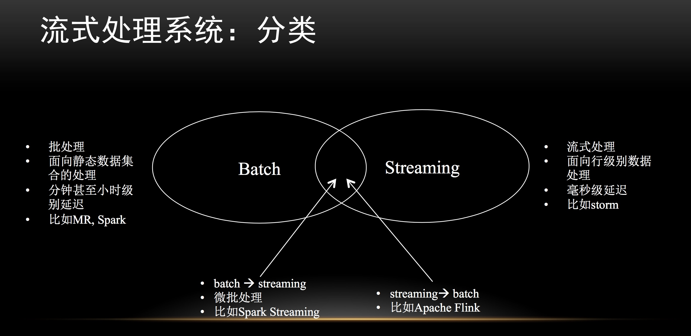
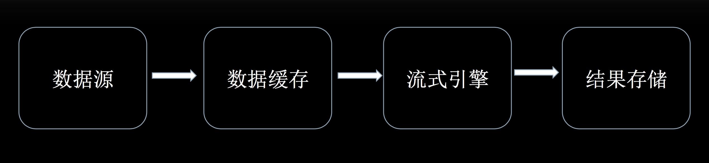
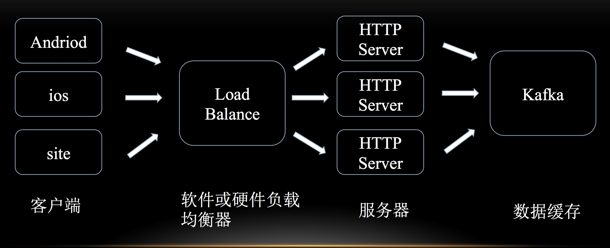
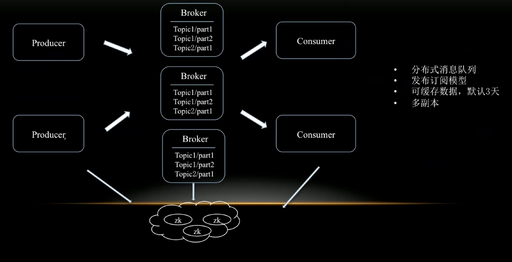
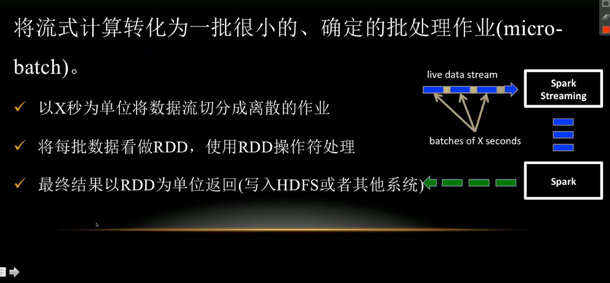
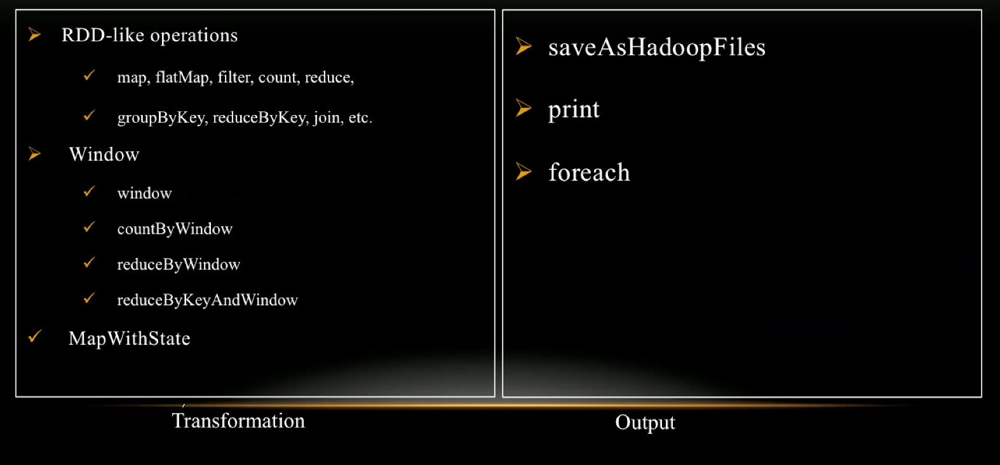
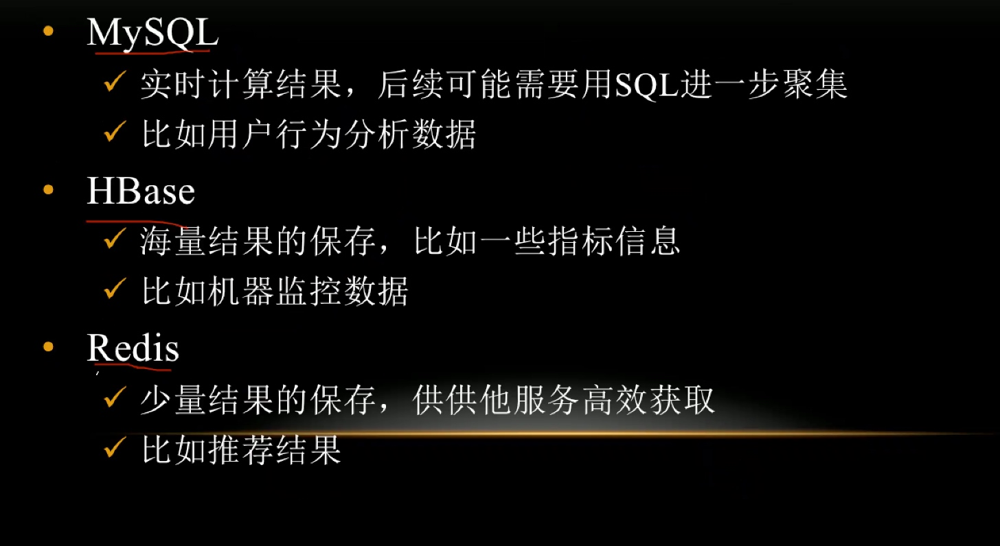
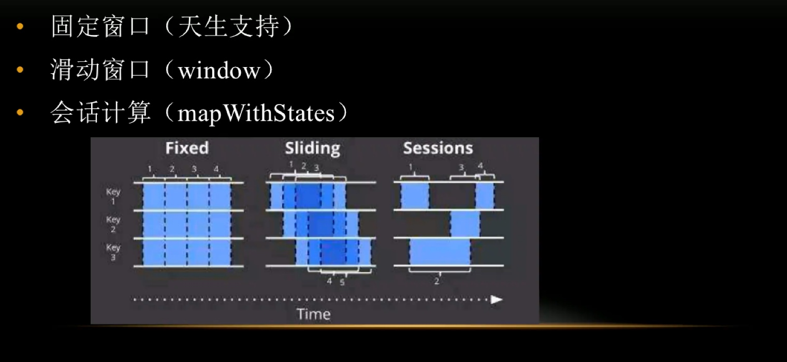
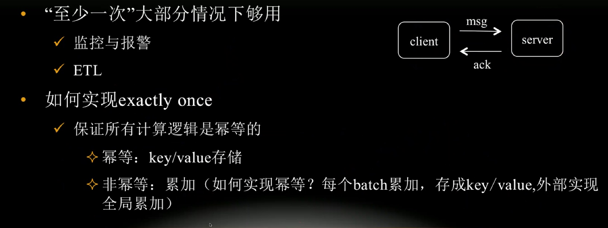
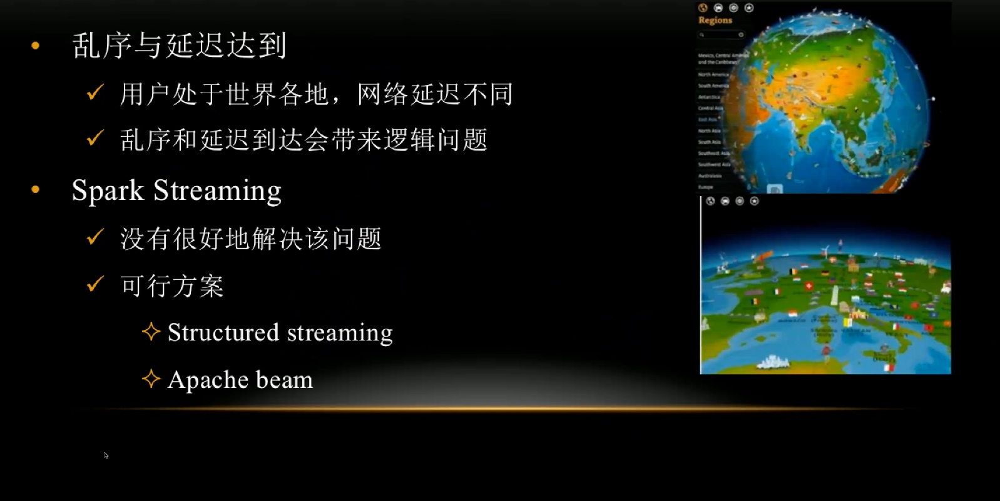

[TOC]

## 大纲
+ 流式处理系统典型应用场景
+ 流式计算引擎分类
+ 流式处理管道构建
+ 流式处理系统关键技术点探讨
+ 流式计算应用

##  流式处理系统

### 背景
1. 流式数据
    + 用户点日志(搜索，评论，搜索，购买等)
    + 机器日志(CPU利用率，内存利用率等)
    + 其他终端设备采集到的数据(物联网，摄像头等)

2. 流式数据来源
    + 移动终端，比如iphone/android手机
    + 网站
    + IoT

### 应用场景
1. 许多重要的应用要处理大量在线流式数据， 并返回近似实时的结果
    + 社交网络趋势追踪
    + 实时推介系统
    + 网站指标实时统计
    + 广告系统
    + 信用卡欺诈检测

    
### 分类

|     批处理      |      流式处理  |
|----------------|--------------|
| 面向静态数据集合的处理   |  面向行级别数据处理 |
| 分钟级甚至小时级别延迟 |  毫秒级延迟 |
| MR，spark          |     Storm   |

+ 融合批处理与流式计算的引擎主键流行
    + 充分结合批处理和流式计算引擎的优势
    + 更容易构建Lambda Architecture

+ 混合计算引擎
    + Apache Spark (Batch->Streaming)
    + Apache Flink(Streaming->Batch)
    + Apache Apex

    
    
    
    ##流式处理管道的构建
    
    

    

    

### 流式数据收集

### kafka

### spark Streaming

### 结果存储

### 关键技术探讨

#### 计算方式

#### 一致性语义

#### 至少一次

#### 乱序与延迟到达

解决了乱序的问题

Structured streaming
apache beam

数据抽象

mapWithCheck  需要使用checkpoint

kafka partition

spark yarn vcore

    
    

